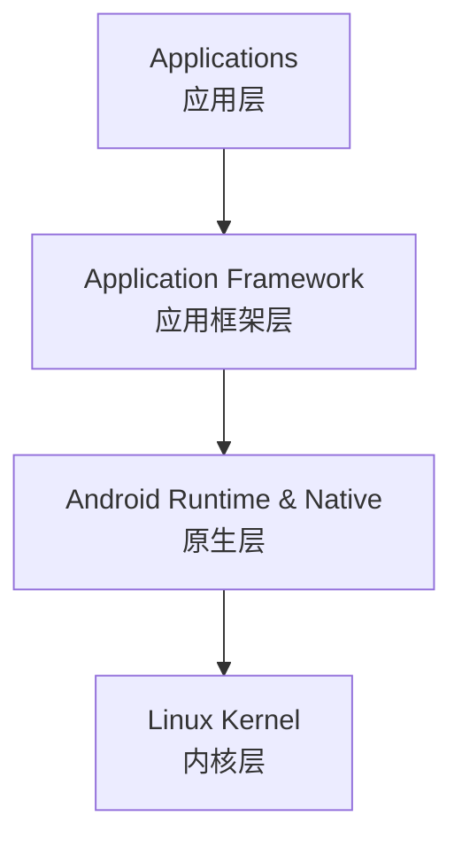

# 安卓系统架构图
----

## 一、四大组件

- Activity 生命周期与启动模式
- Service 类型（Started / Bound）与生命周期
- BroadcastReceiver 注册方式与使用场景
- ContentProvider 数据共享与 URI 设计

## 二、UI系统与自定义View

- View 绘制流程：onMeasure / onLayout / onDraw
- ViewGroup 事件分发机制：dispatchTouchEvent / onInterceptTouchEvent / onTouchEvent
- 自定义 View 实现方式与 Canvas 绘图
- 布局优化：ConstraintLayout / LinearLayout / RelativeLayout 对比
- RecyclerView 回收复用机制与 ViewHolder 模式
- 动画体系：属性动画 / 补间动画 / 帧动画 / Lottie

## 三、多线程与异步机制

- Handler / Looper / MessageQueue 机制
- AsyncTask（已废弃，需了解）
- Thread / ExecutorService / ThreadPoolExecutor
- IntentService / JobIntentService
- LiveData + ViewModel 异步更新
- Kotlin 协程（CoroutineScope / launch / async / withContext）
- Flow / StateFlow / SharedFlow

## 四、内存管理与性能优化

- 内存泄漏常见场景与检测（MAT / LeakCanary）
- OOM 原因与图片内存计算（ARGB_8888, width × height × 4）
- 内存抖动与对象复用
- 启动优化：异步初始化 / 延迟加载 / 类预加载
- 卡顿优化：减少主线程耗时 / 布局扁平化 / 过度绘制优化
- ANR 原因与监控（主线程阻塞 / BroadcastReceiver 超时 / Service 超时）

## 五、网络与数据持久化

- OkHttp 拦截器机制与连接池
- Retrofit 动态代理与 Converter / CallAdapter
- Gson / Moshi / Jackson 数据解析
- SharedPreferences 原理与替代方案（MMKV / DataStore）
- SQLite / Room 数据库操作与事务
- 文件存储与缓存策略（DiskLruCache / Glide 缓存）

## 六、架构与设计模式

- MVC / MVP / MVVM 架构对比
- Android Architecture Components（ViewModel / LiveData / Room / Navigation）
- 单例模式（双重检查锁 / 静态内部类）
- 工厂模式 / 建造者模式 / 观察者模式 / 适配器模式
- 依赖注入（Dagger / Hilt）
- 组件化 / 模块化架构设计
- 插件化 / 热修复基础原理

## 七、系统机制与原理

- App 启动流程（AMS / Zygote / Binder）
- Context 体系（Application / Activity / Service Context）
- Activity 启动流程（Instrumentation / ActivityThread）
- Binder 机制与 AIDL 使用
- Window / WindowManager / DecorView 关系
- LayoutInflater 原理与 View 创建流程
- ClassLoader 机制与 Dex 加载

## 八、安全与调试

- ProGuard / R8 混淆规则
- 应用签名与 V1/V2/V3 签名机制
- 权限管理（运行时权限 / 自定义权限）
- 崩溃捕获（Thread.setDefaultUncaughtExceptionHandler / Bugly）
- 日志管理与线上监控（埋点 / 性能监控 / ANR 收集）
- HTTPS / 证书校验 / 安全加固

## 九、Kotlin 与现代开发

- 空安全机制（? / !! / let / also / apply / run / with）
- 扩展函数 / 属性委托 / 类委托
- 协程结构化并发 / CoroutineScope / SupervisorJob
- Flow 响应式流 / 冷流热流
- 密封类 / 数据类 / 伴生对象
- 高阶函数 / Lambda / inline / crossinline

## 十、Jetpack 与 Compose

- ViewModel / LiveData / StateFlow
- Navigation 组件
- DataStore 替代 SharedPreferences
- WorkManager 后台任务
- Paging3 分页加载
- Compose：remember / mutableStateOf / SideEffect / LaunchedEffect
- Compose 重组机制与性能优化

## 十一、工具与工程化

- Gradle 构建脚本与依赖管理
- 多渠道打包 / BuildConfig / ProductFlavors
- 持续集成（CI/CD）基础
- ADB / Systrace / Profiler / LayoutInspector 使用
- APK 结构分析（DEX / resources.arsc / assets / lib）
- 包体积优化（资源压缩 / 代码混淆 / So 精简）

## 十二、跨平台与新技术

- Flutter 基础与混合开发
- React Native / Weex 原理
- 鸿蒙系统开发差异（Ability / UI 框架 / 分布式）
- 动态化方案（Lua / JS / 插件化）
- AI 集成（ML Kit / TensorFlow Lite）
