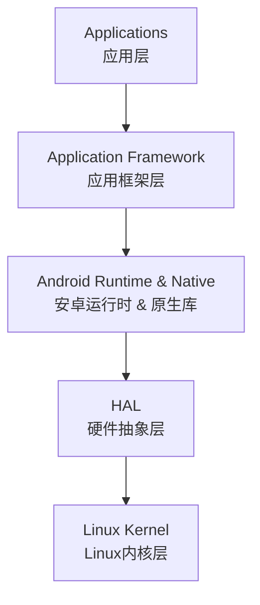

# android

## [应用架构指南](https://developer.android.com/topic/architecture)

## 核心层级

### Applications：

系统应用（桌面、电话、设置）与三方应用使用 Activity/Service/BroadcastReceiver/ContentProvider 组件，运行在沙
箱内（独立 UID、权限模型）。

### Application Framework：

以 Java/Kotlin API 暴露系统服务（ActivityManager、WindowManager、PackageManager 等），通过 Binder 与
System Server 进程通信，控制应用生命周期、资源、权限。

### Android Runtime & Native Libraries：

Android Runtime 运行时负责执行字节码，包含 ahead-of-time 编译、JIT、GC、Profile 优化、多版本兼容；支持多用户模
式下的应用运行。

Native Libraries包含 Bionic C 库、OpenGL ES、Media、SQLite、WebKit 等，对系统服务和 Native 应用提供支持，也承载性
能敏感模块。

### HAL：

以 C/C++ 接口抽象底层硬件（摄像头、音频、传感器等），Vendor 通过实现 HIDL/AIDL 接口与系统服务通信，支持 Treble
后独立于系统镜像更新。

### Linux Kernel：

提供进程调度、内存管理、电源管理、驱动等能力，并引入 binder、ashmem、wakelock、SELinux 等 Android 定制
扩展。
