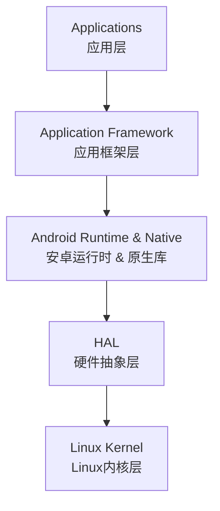

# Android

## Android 应用架构

https://developer.android.com/topic/architecture

## Android 平台架构

https://developer.android.com/guide/platform

```mermaid
graph TD
    A[Applications<br>应用层] --> B[Application Framework<br>应用框架层]
    B --> C[Android Runtime & Native<br>安卓运行时 & 原生库]
    C --> D[HAL<br>硬件抽象层]
    D --> E[Linux Kernel<br>Linux内核层]
``` 
